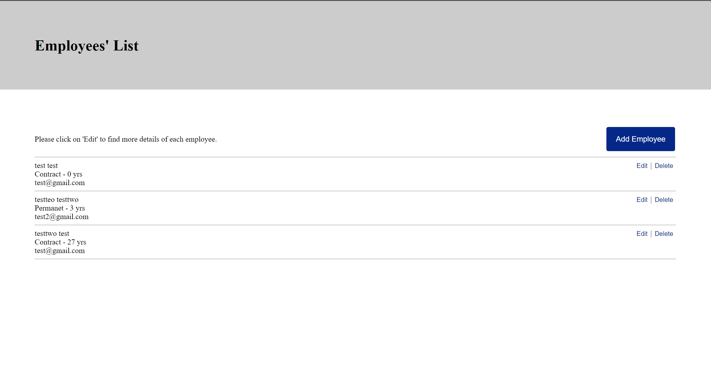
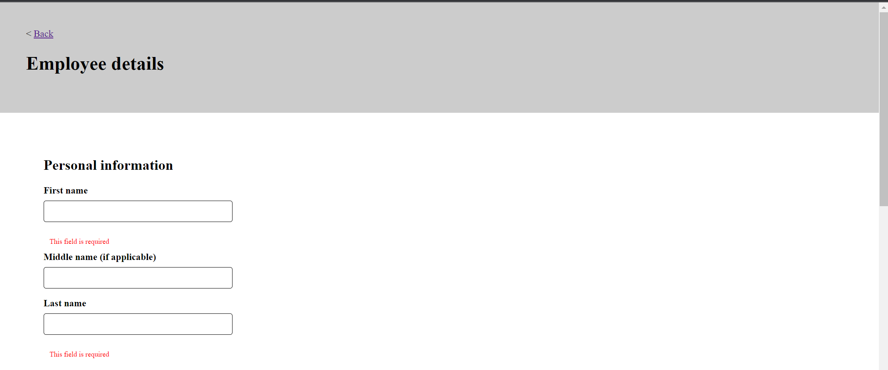
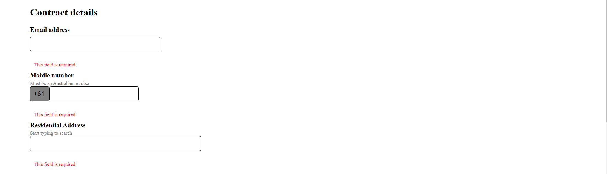
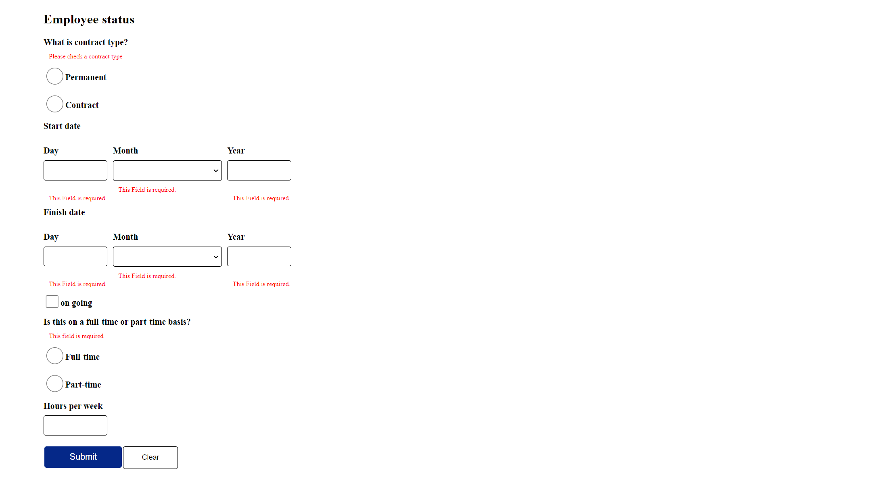

# employee-creator






# Overview
To create web application which can create list, modify and delete employees. The application should consist of a spring RESTful API and a React Typescript frontend. The schema for the employee is left to the criteria of the candidate.

# MVP

# Backend
* This project is employee creator in React + TS as frontend and spring framework as backend. 
* This project has 3 endpoints:
  1. Create an employee.
  2. Get a list of existing employees.
  3. To delete an employee.
* The list of employees is a local MySql database.
* Implementing an API logging strategy.
* Implementing error handling strategy.

# Frontend
- Vite with react-ts
- SCSS
- React Query for API calls
- React Form Hook for form validation & submission
- HTML attributes to required / validate fields before writing your own validation

# Backend Dependencies
```
    - Spring Web,
    - Validation I/O
    - Spring Testing
    - Spring Data JPA
    - MySQL Driver
    - Spring Devtools
  ``` 
# application.properties starter:
```
- spring.datasource.url=jdbc:mysql://localhost:3306/<db_name>
- spring.datasource.username= <username>
- spring.datasource.password= <Your Password>
- spring.jpa.hibernate.ddl-auto=update
- spring.jpa.properties.hibernate.dialect=org.hibernate.dialect.MySQL5InnoDBDialect
- spring.jpa.generate-ddl=true
```

# Under Development:

- Implementing in react redux.
- Implementing an API logging strategy.
- Implementing error handling strategy.
- Frontend and Backend hosting.

